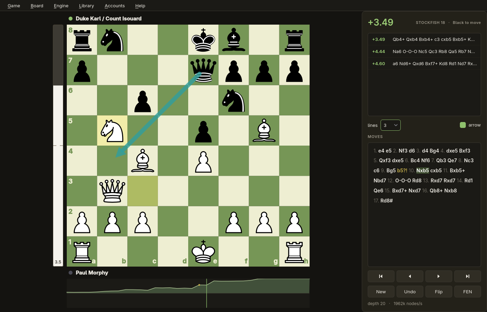

# ChessLab

A desktop chess board with live Stockfish analysis and a personal game
database. Native Qt6 window (PySide6), no web view.

It pulls your games from Lichess and Chess.com into one local SQLite
database, shows where your openings go wrong, and keeps track of
over-the-board tournaments.



## Features

**Board and analysis**
- Continuous Stockfish analysis with several lines (MultiPV), evaluation bar,
  best-move arrow; click a line to play its first move.
- Full game analysis at fixed depth: evaluation graph, `??` / `?` / `?!`
  marks, accuracy per side. Losses are measured in winning chances
  (Lichess formula), not centipawns. Results are cached in the database.
- Variations: a move from the middle of a game starts a branch instead of
  overwriting; promote, demote or delete variations from the move list.
- Arrows and circles with the right mouse button, like on Lichess;
  Shift / Ctrl / Alt change the colour.
- Position setup (Ctrl+E) with FEN input and legality check.
- Written report (Ctrl+Shift+R): the analysed game as Markdown (critical
  moments, best moves, FEN, PGN) — handy to paste into a chat with an AI
  and ask for a plain-language explanation.

**Your games**
- Lichess and Chess.com accounts side by side; incremental download of new
  games. Chess.com's public API needs no token.
- Open a game by link (Ctrl+L), from a PGN file (Ctrl+O) or the clipboard
  (Ctrl+Shift+V). `chesslab game.pgn` opens a file directly.
- Filters by account, colour, time control, result and opening.
- Rating progress chart with day / week / month / year breakdown.

**Openings**
- Opening explorer: your own games and named theory in one table, search by
  name or ECO code, type a line of moves to jump to it.
- Repertoire: mark your move in any position (★, right-click a move or
  the “★ Mine” button) and keep a note per position. Keyed by position, so
  transpositions share an entry; games where you deviated are highlighted.
- Opening statistics: score per variation / family / ECO code, worst first.
- Opening weaknesses: the engine analyses only the opening phase of your
  games and ranks positions by games × lost winning chances. Positions are
  keyed by EPD, so transpositions merge.
- Offline ECO table of ~3,800 named lines.

**Over-the-board tournaments**
- Enter games from paper scoresheets (moves optional), get score and
  performance rating by the FIDE table.
- Fetch tournament details from ratings.fide.com.
- Full crosstable analysis from chess-results.com: upsets, every player's
  performance, strength of schedule, and a choice of how to rate unrated
  players (as listed, fixed value, or iterated performance).

## Installation

Requirements: Python 3, Qt6 via PySide6, [python-chess](https://python-chess.readthedocs.io/),
and a UCI engine — [Stockfish](https://stockfishchess.org/download/).

```sh
git clone https://github.com/vsevolod-kutinov/chesslab.git
cd chesslab
python -m venv .venv
.venv/bin/pip install -r requirements.txt PySide6
.venv/bin/python main.py
```

On Arch Linux and other distributions that ship PySide6 as a system package,
prefer it — it matches the system Qt and its Wayland plugin:

```sh
sudo pacman -S pyside6 stockfish
python -m venv --system-site-packages .venv
.venv/bin/pip install -r requirements.txt
```

The engine is looked up in `~/.local/bin/stockfish`, then on `PATH`;
or pass it explicitly: `main.py --engine /path/to/stockfish`.

Developed and tested on Linux (Python 3.14, PySide6 6.11).

## Data

Everything is stored locally in `~/.local/share/chesslab/`:
`games.sqlite3` (games, analysis, tournaments) and `accounts.json`
(account list, mode 600). Nothing is sent anywhere except requests to
Lichess, Chess.com, FIDE and chess-results for the data you ask for.

## Keyboard shortcuts

| Key | Action |
|---|---|
| ← → / Home End | move back / forward / to start / to end |
| F | flip board |
| Ctrl+N / Ctrl+Z | new game / undo move |
| Ctrl+C / Ctrl+V | copy / paste FEN |
| Ctrl+E | set up position |
| Ctrl+L | open game by link |
| Ctrl+O / Ctrl+Shift+V | open PGN file / paste PGN |
| Ctrl+S | save variations to the database |
| Ctrl+R | analyse game |
| Ctrl+Shift+R | export written report |
| Ctrl+G | my games |
| Ctrl+B | opening explorer |
| Ctrl+D | opening statistics |
| Ctrl+K | opening weaknesses |
| Ctrl+T | my tournaments |
| Ctrl+Y | rating progress |
| Ctrl+I | Lichess statistics |
| right mouse | arrow (drag) or circle (click); Shift / Ctrl / Alt for colour |

## Project layout

| Path | Purpose |
|---|---|
| `main.py` | arguments, engine lookup, Qt start-up |
| `chesslab/window.py` | main window, game state, navigation |
| `chesslab/board.py` | board drawing, move input, setup mode |
| `chesslab/engine.py` | Stockfish process in a worker thread |
| `chesslab/evalbar.py`, `evalgraph.py` | evaluation bar and graph |
| `chesslab/movelist.py` | move list with variations |
| `chesslab/editor.py` | position setup dialog |
| `chesslab/report.py` | Markdown game report |
| `chesslab/games.py`, `games_db.py` | game list window, SQLite database |
| `chesslab/lichess.py`, `chesscom.py` | site APIs |
| `chesslab/accounts.py`, `stats.py`, `rating.py` | accounts, Lichess stats, rating chart |
| `chesslab/explorer.py`, `openings.py` | opening explorer and statistics |
| `chesslab/weakspots.py`, `weaknesses.py` | opening weaknesses: computation and window |
| `chesslab/eco.py`, `data/eco.tsv` | ECO opening table |
| `chesslab/tournaments.py`, `tournaments_db.py` | OTB tournaments |
| `chesslab/fide.py`, `chessresults.py`, `crosstable.py`, `crossreport.py` | FIDE and chess-results import, crosstable analysis |
| `chesslab/theme.py` | palette, spacing, fonts, QSS — all styling lives here |
| `tools/` | ECO table builder, sound generator, command-line opening analysis |

The engine runs in a plain `threading.Thread`, not a `QThread`: reading from
Stockfish blocks, so a Qt event loop in that thread would never run. It only
talks to the GUI through Qt signals.

## Notes

- Opening a Chess.com game by link uses the site's internal
  `callback/live/game` endpoint, since the public API has no single-game
  lookup. It is undocumented and may change or break.
- Chess.com monthly archives are cached by Cloudflare for up to ~30 minutes,
  so a game you just finished may not show up right away.
- Games against Chess.com bots are not part of the public archive.

## Credits

- [python-chess](https://github.com/niklasf/python-chess) — rules, PGN, UCI;
  pieces are its built-in Cburnett set.
- Opening names: [lichess-org/chess-openings](https://github.com/lichess-org/chess-openings) (CC0).
- [Stockfish](https://stockfishchess.org/).

## License

GPL-3.0-or-later — see [LICENSE](LICENSE).
